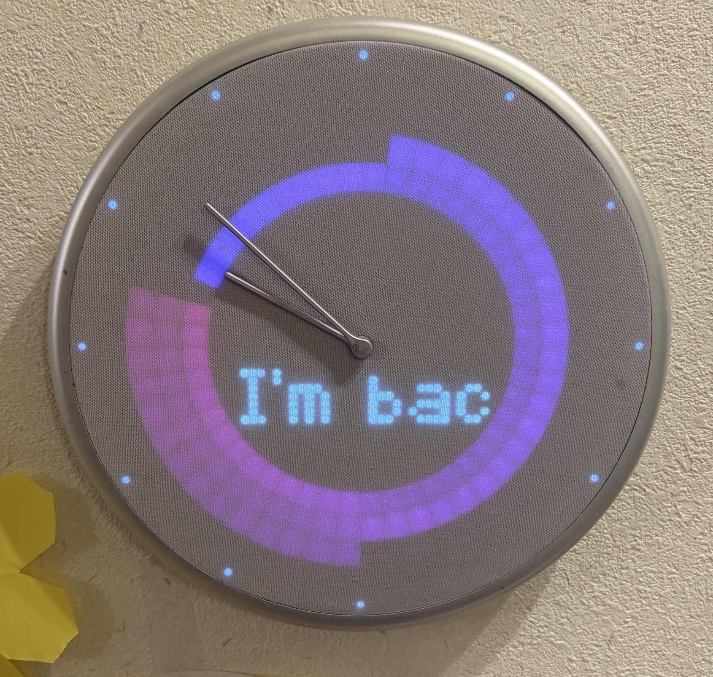

# m5stack-glance-clock

Bringing my Glance Clock back to life using an ESP32 (M5Stack) as a bridge.

---

## Overview
This repository contains code and binaries to revive a non-functional "Glance Clock" by using an ESP32 (M5Stack) as a bridge. It smartly resurrects the clock from the outside without modifying the original internal firmware.

<div align="center">
  
</div>

---

## Demonstration
Here is a [video](https://youtu.be/5_j0KFj5OKg) demonstrating control via a web browser and iPhone Shortcuts.

---

## Features
- **ESP32 Bridge**: Acts as a relay using M5Stack [Basic](https://docs.m5stack.com/en/core/basic) or [AtomS3 Lite](https://docs.m5stack.com/en/core/AtomS3%20Lite) to send data to the Glance Clock via BLE.
- **Web API**: Can be operated through HTTP requests from browsers, home automation tools, or API clients.
- **Captive Portal Support**: Easily configure SSID and passwords from a smartphone or PC during initial startup or Wi-Fi configuration.

---

## Requirements & Architecture

To get started, here are the minimum requirements and how the system architecture works:

### Hardware & Tools
- **Glance Clock**: The target device to revive.
- **ESP32**: M5Stack Basic or AtomS3 Lite.
- **PC**: Required to flash the firmware/program to the M5Stack.

### System Workflow
```text
[ Control Triggers ]
- Home Assistant (Automations / Sensor integration)
- Raspberry Pi (Periodic / Event transmissions via Node-RED, etc.)
- Smartphone Browser / iOS Shortcuts (Manual / Widget operations)
        ↓ (HTTP Requests)
[ ESP32 Bridge ]
- Wi-Fi connection & Built-in HTTP server
- Accurate time synchronization via NTP (CTS function)
- Translates received messages according to the protocol
        ↓ (BLE Communication)
[ Glance Clock ]
- Text scrolling display / Notifications / Animations
```

---

## Repository Structure
```text
m5stack-glance-clock/
├── docs/
│   └── m5stack_deployment_guide.md  # Detailed Arduino IDE & esptool configuration guide
├── src                 
│   └── GlanceBridge.ino             # Source code
├── tools 
│   └── GlanceCommand.html           # GUI tool
└── build/                           # Prebuilt binaries for Web Flusher, etc.
    ├── firmware.bin
    ├── partitions.bin
    └── bootloader.bin
```

---

## Installation & Flashing

### Option A: Direct Flashing via Web Flusher (Prebuilt Binaries)
You can directly flash the firmware via a browser-based Web Flusher without setting up a development environment (like Arduino IDE).

1. Connect the M5Stack to your PC via a USB cable.
2. Open a Web Flusher tool like [esptool-js](https://espressif.github.io/esptool-js/) in a Chromium-based browser (Chrome or Edge).
3. Specify the files located in the `build/` folder to their respective address offsets based on your hardware target:

| Binary File | M5Stack Core Basic (ESP32) | AtomS3 / AtomS3 Lite (ESP32-S3) |
| :--- | :--- | :--- |
| `bootloader.bin` | **`0x1000`** | **`0x0`** |
| `partitions.bin` | **`0x8000`** | **`0x8000`** |
| `boot_app0.bin` *(if present)* | **`0xe000`** | **`0xe000`** |
| `firmware.bin` | **`0x10000`** | **`0x10000`** |

> ⚠️ **Note:** Pay close attention to the `bootloader.bin` address! Flashing to `0x1000` on an AtomS3 (ESP32-S3) will cause a boot checksum failure.

### Option B: Building from Source (Arduino IDE)
If you want to modify the code or build the binary yourself using Arduino IDE:

1. Open `src/GlanceBridge.ino` in Arduino IDE.
2. Select your target board and configure board options (`Flash Mode`, `Partition Scheme`, `USB CDC On Boot`, etc.).
3. For exact tool menu configurations and command-line `esptool` flashing procedures for both **M5Stack Core Basic** and **AtomS3 Lite**, please consult the 👉 **[M5Stack Deployment & Configuration Guide](docs/m5stack_deployment_guide.md)**.

---

## Usage & Captive Portal
1. Restart the M5Stack after flashing the firmware.
2. Upon initial startup, since there are no Wi-Fi settings configured, the M5Stack operates in Access Point (AP) mode.
3. Connect to the Wi-Fi network broadcasted by the M5Stack (`M5Stack-Setup`) from your smartphone or PC's Wi-Fi settings screen.
4. The Captive Portal configuration screen will automatically pop up (or appear when you open a browser).
5. Enter your home Wi-Fi SSID and password and save them; the M5Stack will then connect to your home network.
6. Once the PIN code appears on the clock's display, enter `http://glance-clock.local/pin?code=[PIN-code]` to start operating as a bridge.

---

## Known Issues / Limitations
- **Calendar Integration Feature**:  
  Currently, the calendar integration feature (`/calendar`) is not correctly documented due to a lack of parsed information. Please use with caution.
- **Timezone & NTP**:  
  The timezone is hardcoded to Japan Standard Time (JST+9) at `9 * 3600` seconds using the NICT NTP server (`ntp.nict.jp`). If you use the device outside of Japan or in a different timezone, please update `gmtOffset_sec` as well as the NTP server.

---

## Acknowledgements
This project would not have been possible without the invaluable prior research and open-source contributions by predecessors in the community. I am deeply grateful to:

- **Hypfer** for [Hypfer/glance-clock](https://github.com/Hypfer/glance-clock) (BLE protocol reverse-engineered)
- **frannraf** for [frannraf/glance-clock-control](https://github.com/frannraf/glance-clock-control)

If they had not shared their information and code with the public, I would not have been able to achieve any of this. Thank you so much for paving the way!

---

## Disclaimer
This project is an unofficial, independent third-party implementation based on reverse-engineered protocols. It is not affiliated with, authorized, maintained, or sponsored by the original hardware manufacturer. 

Use of this firmware, bridge software, and web tools is entirely at your own risk. The author assumes no responsibility or liability for any damage to your hardware, data loss, or any other issues arising from the use of this project.

---

## License
This software is released under the [MIT License](LICENSE).